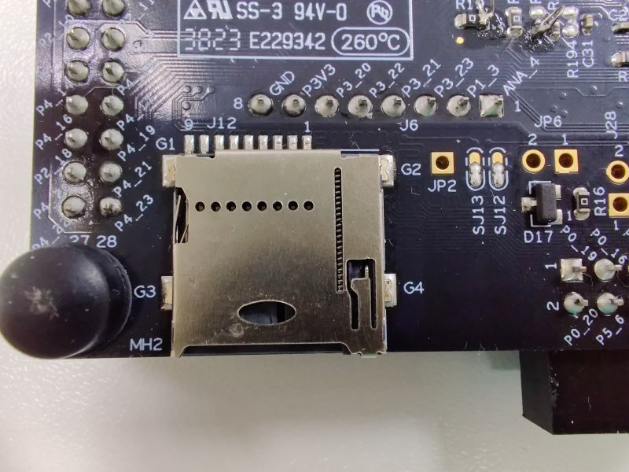
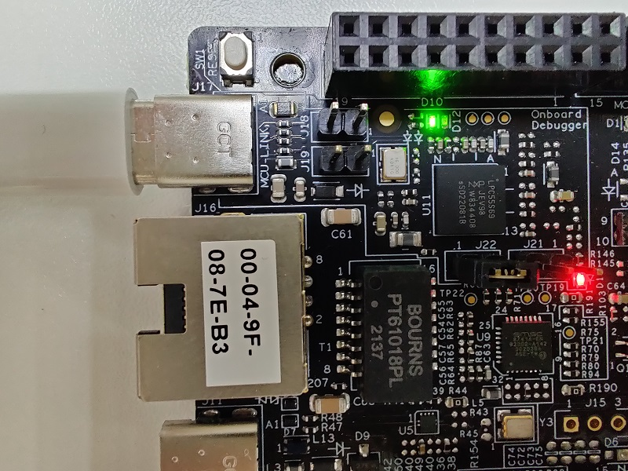
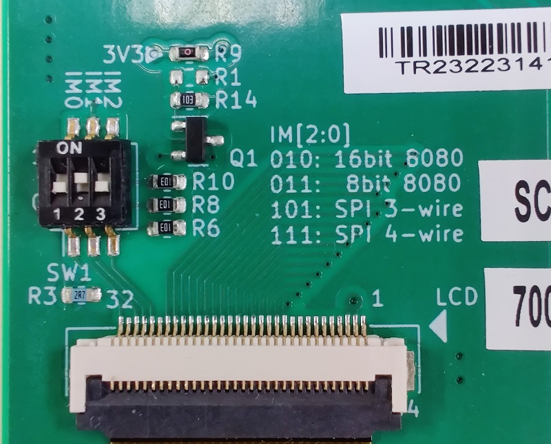
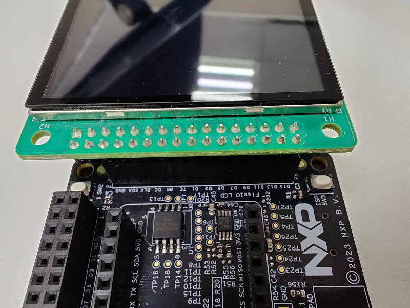
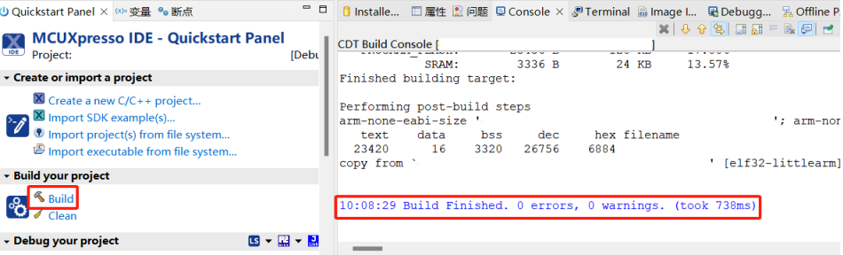
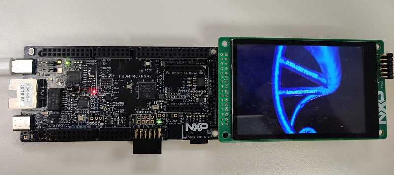

# NXP Application Code Hub
[](https://www.nxp.com)

## Raw Video Playback Demo for MCXN947
This project demonstrates how to create a raw video file and use minimal
CPU resource to achieve high refresh rate on performance constrained MCU.

In this project, we'll demonstrate using FRDM-MCXN947 and LCD-PAR-S035
to display the video content from a MP4 file on the LCD.

#### Boards: FRDM-MCXN947
#### Categories: Graphics, SDMMC
#### Peripherals: SDMMC, DISPLAY
#### Toolchains: MCUXpresso IDE

## Table of Contents
1. [Software](#software)
2. [Hardware](#hardware)
3. [Setup](#setup)
4. [Results](#step4)
5. [FAQs](#step5) 
6. [Support](#step6)
7. [Release Notes](#step7)

## 1. Software<a name="software"></a>
- Download and install [MCUXpresso IDE V11.9.0 or later](https://www.nxp.com/design/design-center/software/development-software/mcuxpresso-software-and-tools-/mcuxpresso-integrated-development-environment-ide:MCUXpresso-IDE).
- Download and install the latest version of [FreeMASTER](https://www.nxp.com/design/software/development-software/freemaster-run-time-debugging-tool:FREEMASTER)(3.2.2.2).
- MCUXpresso for Visual Studio Code: This example supports MCUXpresso for Visual Studio Code, for more information about how to use Visual Studio Code please refer [here](https://www.nxp.com/design/training/getting-started-with-mcuxpresso-for-visual-studio-code:TIP-GETTING-STARTED-WITH-MCUXPRESSO-FOR-VS-CODE).
- Download and install Ruby v3.2 or later from [RubyInstaller for Windows](https://rubyinstaller.org/).
- Download and install FFMpeg v6.0 or later from [FFmpeg website](https://ffmpeg.org/download.html)

> This project *recommends* using Linux operating system or Windows Subsystem for Linux (WSL) to perform
> video conversion operation. To install the above dependencies in a typical Linux environment, follow
> your package manager's manual.

Typical installation for Ubuntu (WSL) is:
```sh
sudo apt update
sudo apt install -y build-essential ruby ruby-dev ffmpeg libmagick-dev
```


## 2. Hardware<a name="hardware"></a>

### 2.1 Development Board
This project uses FRDM-MCXN947 development kit available from NXP.

<!-- TBD: Add purchase link to this section  -->

### 2.2 LCD Module
This project uses PAR-LCD-S035 LCD module available from NXP.

<!-- TBD: Add purchase link to this section -->

### 2.3 MicroSD Card Slot
The FRDM-MCXN947 ships with MicroSD card slot unpopulated,
The MicroSD card slot part number is MEM2075 manufactured by GCT.

The MicroSD card slot can be purcased from one of the [distributors of GCT](https://gct.co/instock/mem2075)

### 2.4 MicroSD Card
This project requires a MicroSD card to store the converted raw video file.
User will need to prepare a MicroSD card formatted with FAT32 or exFAT with sufficient (>= 1GiB) free space.

## 3. Setup<a name="setup"></a>

### 3.1 Hardware Setup - FRDM-MCXN947
The MicroSD card slot (J12) needs to be soldered on to the back side of the FRDM-MCXN947 board.
The soldered board is illustrated on the image below:



Connect the FRDM-MCXN947 board to PC using USB-C connector J17:



### 3.2 Hardware Setup - LCD Module
Configure the LCD module interface to 16-bit 8080 by setting the MODE switch (SW1) to 0-1-0.



Connect LCD module connector J1 to FRDM-MCXN947 LCD connector J8:
> Note: Disconnect USB cable when connecting the LCD module,
> re-plug the cable **AFTER** validating the LCD connection is correct.



### 3.3 Software Setup - MCUXpresso IDE Project
1. Open MCUXpresso IDE, in the Quick Start Panel, choose **Import from Application Code Hub**    


2. Enter the demo name in the search bar.   

 

3. Click **Copy GitHub link**, MCUXpresso IDE will automatically retrieve project attributes, then click **Next>**.   


4. Select **main** branch and then click **Next>**, Select the MCUXpresso project, click **Finish** button to complete import.   


5. Click **Build** to start compiling the project.



### 3.4 Software Setup - Flash
Use the "GUI Flash Tool" from the tool bar to download the project 

### 3.5 Software Setup - Video Converter
1. Prepare a video file supported by ffmpeg
2. Navigate to the [tools](tools) directory of the repository
3. Create a directory named `video` under the [tools](tools) directory
3. Execute the following command under the [tools](tools) directory to create images from video file:

```sh
ffmpeg -i <Your_Video_File> -vf "scale=480:320,setsar=1:1" -r 30/30 video/%05d.bmp
```

4. Install dependencies for conversion script under the [tools](tools) directory using the following command:

```sh
bundle config set --local path vendor/bundle
bundle
```

5. Generate merged binary files using the following command:
```sh
ruby convert_images.rb

```

### 3.6 Software Setup - SD Card Preparation
Generated video file is stored at `tools/video/video_480_320.bin`. Copy the file to the root directory of the MicroSD card.


## 4. Results<a name="step4"></a>
Insert the MicroSD card to the card slot, video will be displayed on the LCD after board reset.



## 5. FAQs<a name="step5"></a>
1. Converter script issues
    * Using CLI tools on Windows environment may cause dependency issues, especially build environments.
      It's recommended to use Windows Subsystem for Linux (WSL) for video conversion.

## 6. Support<a name="step6"></a>
*Please use issues tab to submit support requests or other issues*

#### Project Metadata
<!----- Boards ----->
[](https://github.com/search?q=org%3Anxp-appcodehub+FRDM-MCXN947+in%3Areadme&type=Repositories)

<!----- Categories ----->
[](https://github.com/search?q=org%3Anxp-appcodehub+graphics+in%3Areadme&type=Repositories) [](https://github.com/search?q=org%3Anxp-appcodehub+sdmmc+in%3Areadme&type=Repositories)

<!----- Peripherals ----->
[](https://github.com/search?q=org%3Anxp-appcodehub+sdmmc+in%3Areadme&type=Repositories) [](https://github.com/search?q=org%3Anxp-appcodehub+display+in%3Areadme&type=Repositories)

<!----- Toolchains ----->
[](https://github.com/search?q=org%3Anxp-appcodehub+mcux+in%3Areadme&type=Repositories)

Questions regarding the content/correctness of this example can be entered as Issues within this GitHub repository.

>**Warning**: For more general technical questions regarding NXP Microcontrollers and the difference in expected funcionality, enter your questions on the [NXP Community Forum](https://community.nxp.com/)

[](https://www.youtube.com/@NXP_Semiconductors)
[](https://www.linkedin.com/company/nxp-semiconductors)
[](https://www.facebook.com/nxpsemi/)
[](https://twitter.com/NXP)

<!-- ffmpeg -i $1 -vf "scale=480:320,setsar=1:1" -r 1/1 %05d.bmp -->

## 7. Release Notes<a name="step7"></a>
| Version | Description / Update                           | Date                        |
|:-------:|------------------------------------------------|----------------------------:|
| 1.0     | Initial release on Application Code Hub        | January 30<sup>th</sup> 2024 |

